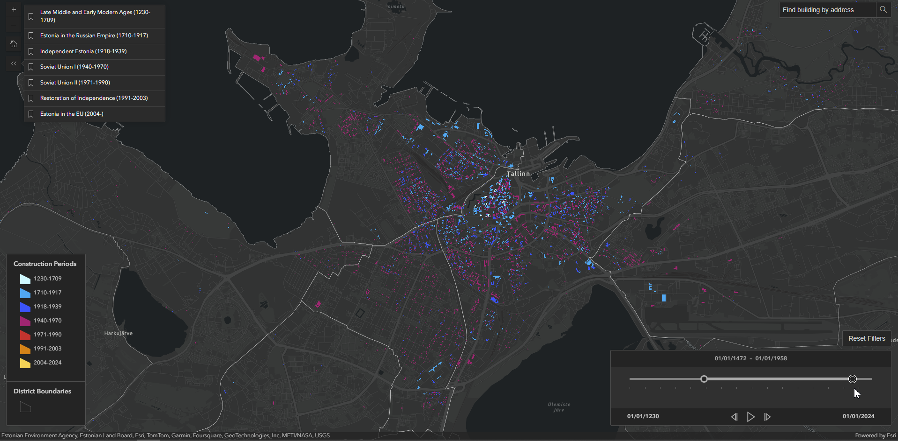
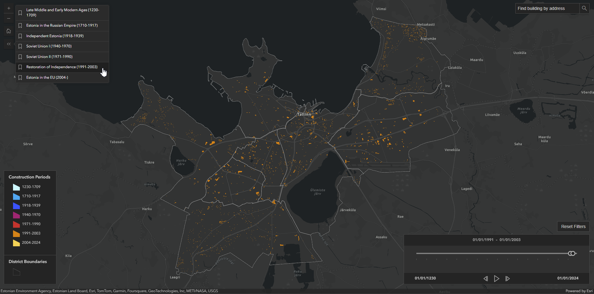
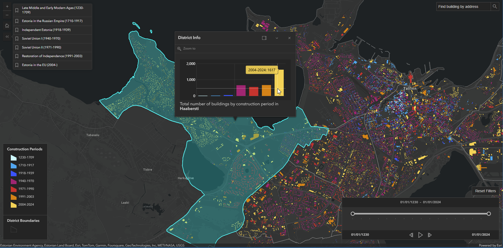
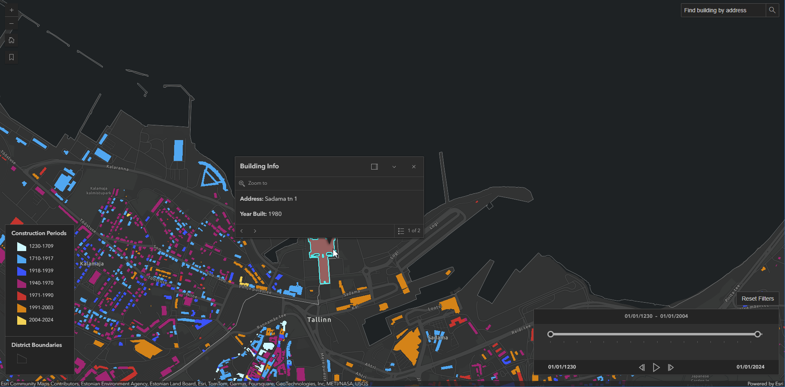
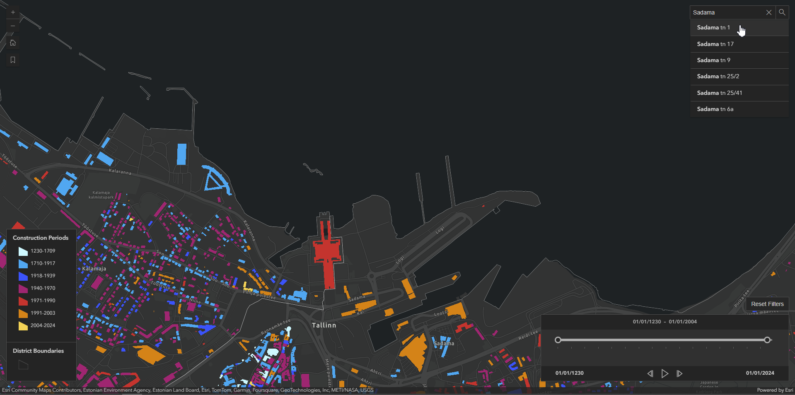

# ArcGIS JS SDK Tallinn buildings map

This project is an interactive map that visualizes buildings in Tallinn, color-coded by their construction periods. It leverages the [ArcGIS Maps SDK for JavaScript](https://developers.arcgis.com/javascript/latest/) for the map development and uses [Vite](https://vite.dev/) for building and deployment. 

This project utilizes an ArcGIS Online WebMap, which serves as a central component for managing map layers and their associated data. The layers are accessed programmatically by their titles. The building layer includes only the buildings with the indicated year of construction (27,508 in total).

Live demo: 

## Features

### 1. **Time Slider**
  - The time slider enables users to filter buildings on the map according to their construction years. The time range can be adjusted by moving the slider thumbs, which are also accessible via keyboard for precise adjustments using the arrow keys. Click on a thumb to activate it for keyboard use.

  - The Reset Filters button removes all filters, returning the map to display all buildings across the entire time frame. This button also resets the time slider to its full extent, spanning the years 1230 to 2024, and clears any filters set by bookmarks.

### 2. **Bookmarks with year ranges**

  - Predefined bookmarks enable quickly filtering buildings by historical periods.
  - When a bookmark is selected, the map’s time extent and the layer’s definition expression update to show buildings within the selected year range.

### 3. **Popups**
  - When clicking on a district, the popup displays a bar chart showing the total number of buildings categorized by their construction periods.

  - For individual buildings, the popup provides information about the address and the year it was constructed.

### 4. **Search by Address**
  - The Search by Address bar allows finding specific buildings by entering their address. It searches for the entered address within the buildings layer. However, since not all buildings are represented on the map, some specific addresses might be missing from the results.

